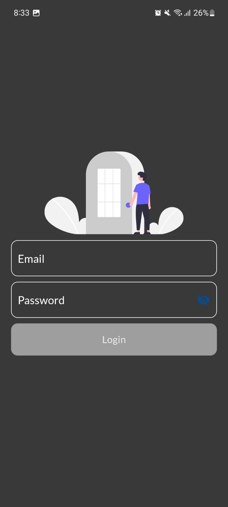
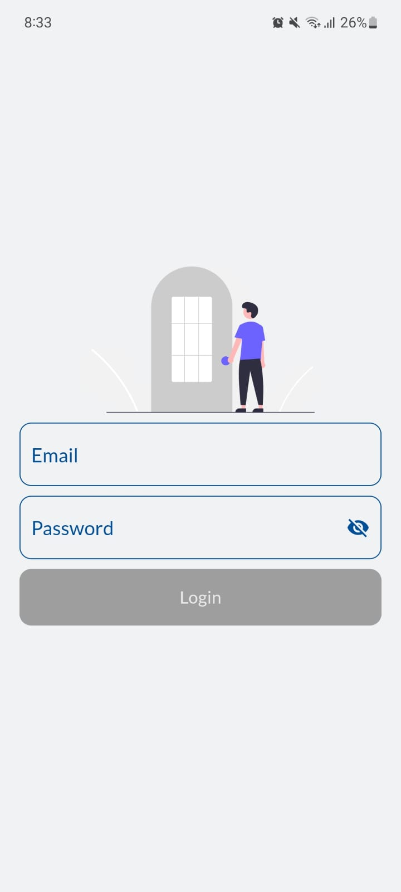
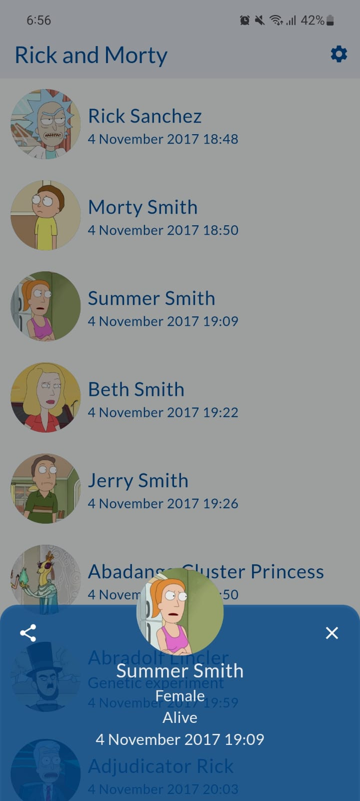
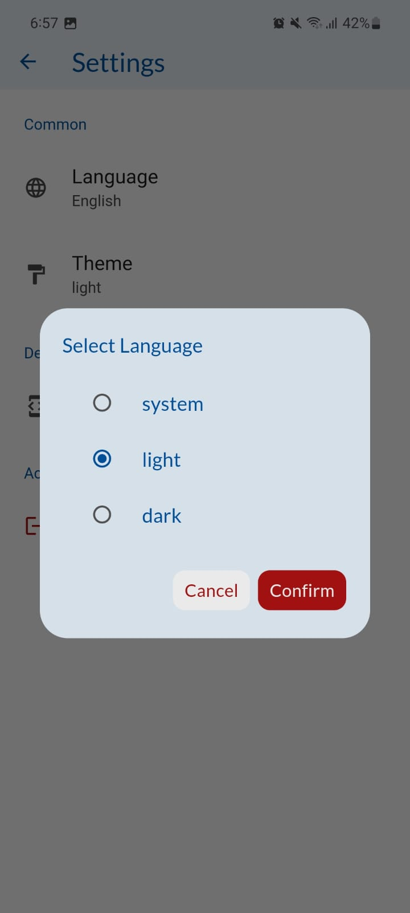
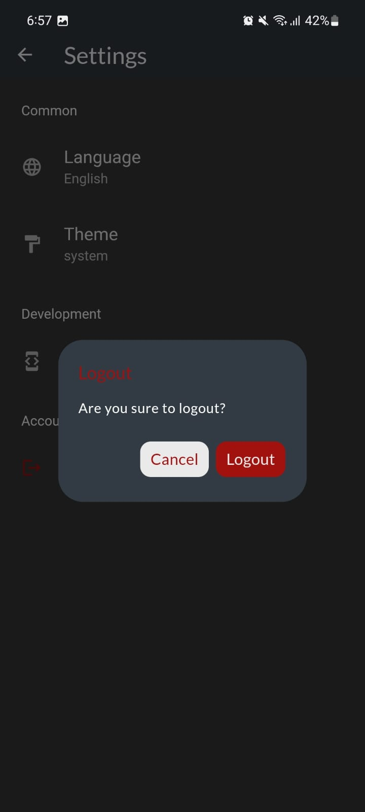
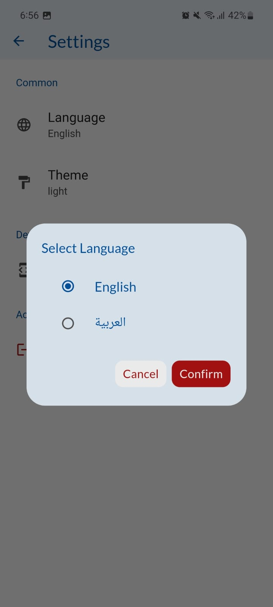

## Flutter project targets Android, iOS, Web Desktop.

## Compose Multiplatform AWESOME :partying_face: :partying_face: :partying_face:

  
  
  
  
  
  

## Credentials 
Enter any Email and password to login within the app (It's just a fake login flow) 

## Libraries
- [dio](https://pub.dev/packages/dio) for handling network requests.
- [sqflite](https://pub.dev/packages/sqflite) for saving cached movies.
- [get_it](https://pub.dev/packages/get_it) for dependency management.
- [cached_network_image](https://pub.dev/packages/cached_network_image) for loading images.
- [shared_preferences](https://pub.dev/packages/shared_preferences) for saving key-value pairs.
- [easy_localization](https://pub.dev/packages/easy_localization)
- [internet_connection_checker](https://pub.dev/packages/internet_connection_checker)
- [modal_bottom_sheet](https://pub.dev/packages/modal_bottom_sheet)

## Feature
- Light/Dark theme
- Localization
- Caching.